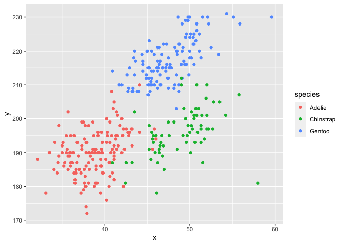

Homework 1
================
Kexin Sun

This is my solution to Homework 1.

``` r
library(tidyverse)
```

    ## ── Attaching packages ────────────────────────────────────────────────────────── tidyverse 1.3.0 ──

    ## ✓ ggplot2 3.3.2     ✓ purrr   0.3.4
    ## ✓ tibble  3.0.3     ✓ dplyr   1.0.2
    ## ✓ tidyr   1.1.2     ✓ stringr 1.4.0
    ## ✓ readr   1.3.1     ✓ forcats 0.5.0

    ## ── Conflicts ───────────────────────────────────────────────────────────── tidyverse_conflicts() ──
    ## x dplyr::filter() masks stats::filter()
    ## x dplyr::lag()    masks stats::lag()

## Problem 1

Create a data frame with the specified elements.

``` r
prob1_df = 
  tibble(
    samp = rnorm(10),
    samp_gt_0 = samp > 0,
    char_vec = c("a","b","c","d","e","f","g","h","i","j"),
    factor_vec = factor(c("low","low","low","mod","mod","mod","mod","high","high","high"))
)
```

Take the mean of each variable in my data frame.

``` r
mean(pull(prob1_df, samp))
```

    ## [1] 0.4021717

``` r
mean(pull(prob1_df, samp_gt_0))
```

    ## [1] 0.7

``` r
mean(pull(prob1_df,char_vec))
```

    ## Warning in mean.default(pull(prob1_df, char_vec)): argument is not numeric or
    ## logical: returning NA

    ## [1] NA

``` r
mean(pull(prob1_df,factor_vec))
```

    ## Warning in mean.default(pull(prob1_df, factor_vec)): argument is not numeric or
    ## logical: returning NA

    ## [1] NA

I can take the mean of numbers and logical but not character or factor.

``` r
as.numeric(pull(prob1_df, samp))
```

    ##  [1]  0.28155158  0.51897920  2.03774616  0.97868097 -0.25761574 -0.44208950
    ##  [7]  0.44899152 -0.27480198  0.69249277  0.03778239

``` r
as.numeric(pull(prob1_df, samp_gt_0))
```

    ##  [1] 1 1 1 1 0 0 1 0 1 1

``` r
as.numeric(pull(prob1_df,char_vec))
```

    ## Warning: NAs introduced by coercion

    ##  [1] NA NA NA NA NA NA NA NA NA NA

``` r
as.numeric(pull(prob1_df,factor_vec))
```

    ##  [1] 2 2 2 3 3 3 3 1 1 1

``` r
as.numeric(pull(prob1_df, samp_gt_0)) * pull(prob1_df, samp)
```

    ##  [1] 0.28155158 0.51897920 2.03774616 0.97868097 0.00000000 0.00000000
    ##  [7] 0.44899152 0.00000000 0.69249277 0.03778239

``` r
as.numeric(pull(prob1_df,factor_vec)) * pull(prob1_df, samp)
```

    ##  [1]  0.56310317  1.03795840  4.07549231  2.93604292 -0.77284723 -1.32626850
    ##  [7]  1.34697457 -0.27480198  0.69249277  0.03778239

## Problem 2

Load the “penguins” dataset.

``` r
data("penguins", package = "palmerpenguins")
```

# Section 1

Short description of penguins dataset:

\<\<\<\<\<\<\< HEAD There are 8 variables and 344 observations in this
data set, and variables are “species, island, bill\_length\_mm,
bill\_depth\_mm, flipper\_length\_mm, body\_mass\_g, sex, year”.

For variable **species**, levels are Adelie, Chinstrap, Gentoo.

For variable **island**, levels are Biscoe, Dream, Torgersen.

For variable **bill\_length\_mm**, range is 32.1, 59.6.

For variable **bill\_depth\_mm**, range is 13.1, 21.5.

For variable **flipper\_length\_mm**, range is 172, 231.

For variable **body\_mass\_g**, range is 2700, 6300.

For variable **year**, range is 2007, 2009.

For variable **sex**, levels are female, male.

``` r
ncol(penguins)
```

    ## [1] 8

``` r
nrow(penguins)
```

    ## [1] 344

``` r
names(penguins)
```

    ## [1] "species"           "island"            "bill_length_mm"   
    ## [4] "bill_depth_mm"     "flipper_length_mm" "body_mass_g"      
    ## [7] "sex"               "year"

``` r
levels(pull(penguins,species))
```

    ## [1] "Adelie"    "Chinstrap" "Gentoo"

``` r
levels(pull(penguins,island))
```

    ## [1] "Biscoe"    "Dream"     "Torgersen"

``` r
range(pull(penguins,bill_length_mm),na.rm = TRUE)
```

    ## [1] 32.1 59.6

``` r
range(pull(penguins,bill_depth_mm),na.rm = TRUE)
```

    ## [1] 13.1 21.5

``` r
range(pull(penguins,flipper_length_mm),na.rm = TRUE)
```

    ## [1] 172 231

``` r
range(pull(penguins,body_mass_g),na.rm = TRUE)
```

    ## [1] 2700 6300

``` r
range(pull(penguins,year))
```

    ## [1] 2007 2009

``` r
levels(pull(penguins,sex))
```

    ## [1] "female" "male"

I also take the mean of flipper length, and it is 200.9152047.

``` r
mean(pull(penguins,flipper_length_mm),na.rm = TRUE)
```

    ## [1] 200.9152

# Section 2

Scatter plot of flipper\_length\_mm (y) vs bill\_length\_mm (x)

``` r
plot_df = tibble(
  x = pull(penguins, bill_length_mm),
  y = pull(penguins, flipper_length_mm),
  species = pull(penguins, species)
)

ggplot(plot_df, aes(x = x, y = y, color = species)) + geom_point()
```

    ## Warning: Removed 2 rows containing missing values (geom_point).

<!-- -->

Export the ggplot

``` r
ggsave("scatter_plot.pdf", height = 4, width = 6)
```

    ## Warning: Removed 2 rows containing missing values (geom_point).
